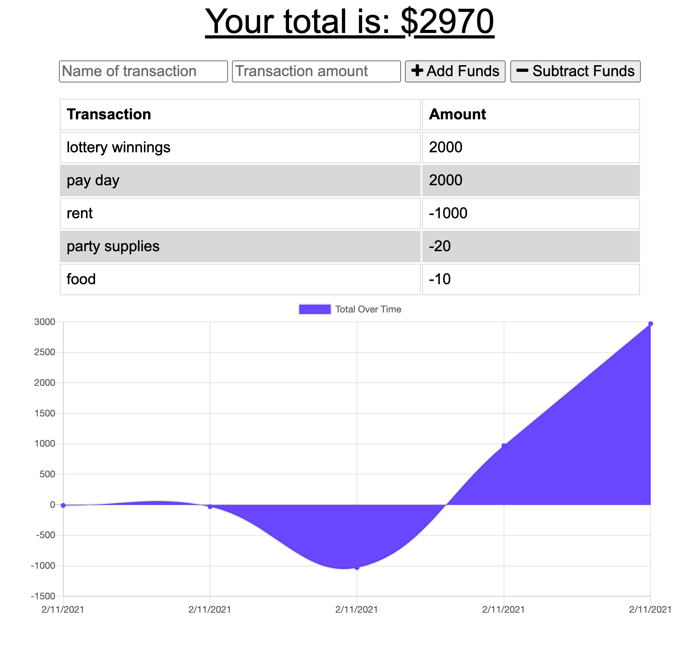

# PWA-Budget-Tracker_HS
  
## Description
This Budget Tracker application allows offline access and functionality. Add expenses and deposits to the budget with or without a connection. Then the total will be updated when back online.
https://github.com/HannahStarcevich/PWA-Budget-Tracker_HS
https://hs-pwa-budget-tracker.herokuapp.com/

## Table of Contents
* [Installation](#installation)
* [Usage](#usage)
* [Contributing](#contributing)
* [License](#license)
        
## Installation
User download the Progressive Web App by clicking the download button in the upper right hand corner of your browser (Chrome). Interacting developers must install JSON dependencies, Compression, Express, Lite-Server, Mongoose and Morgan.

## Usage
Use this application to add or subtract transaction values from your total budget and view dynamic budget data. Enter information both on and offline, data is stored in the cache and uploaded once your back online.

   
        
## Contributing
HannahStarcevich

## License
[MIT](#https://choosealicense.com/licenses/mit/)